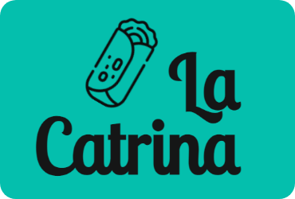
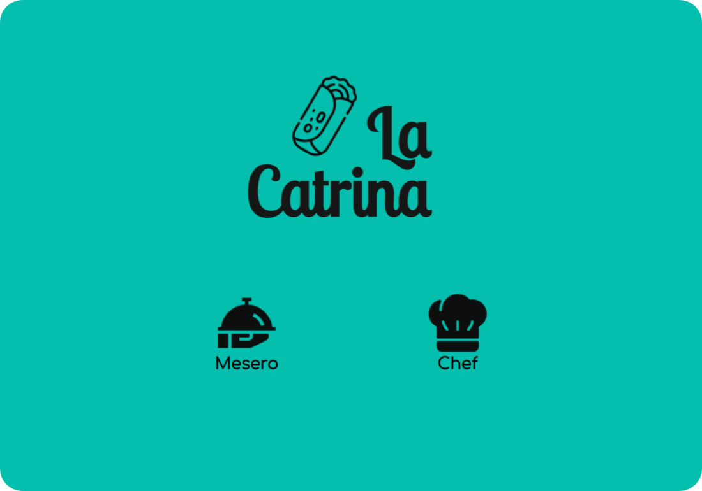
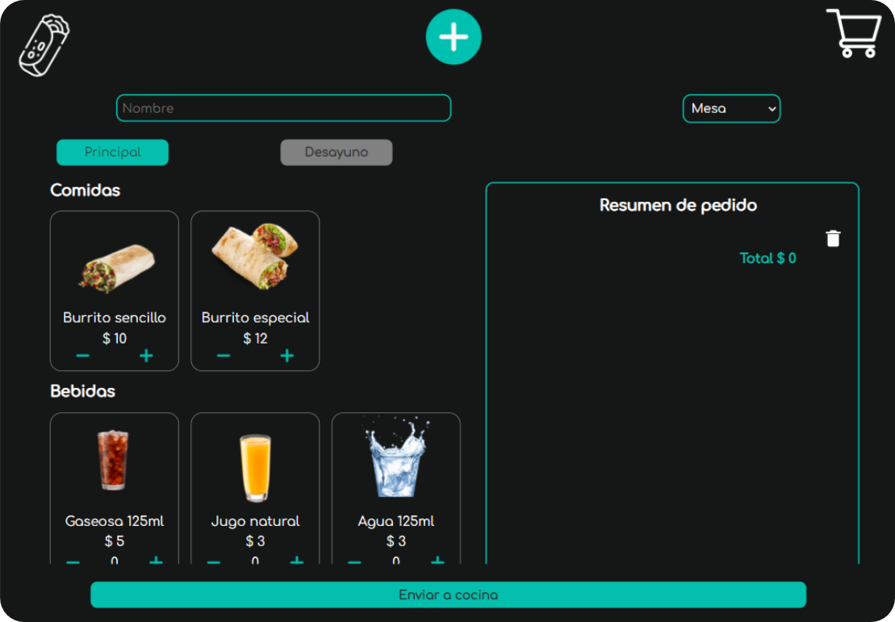
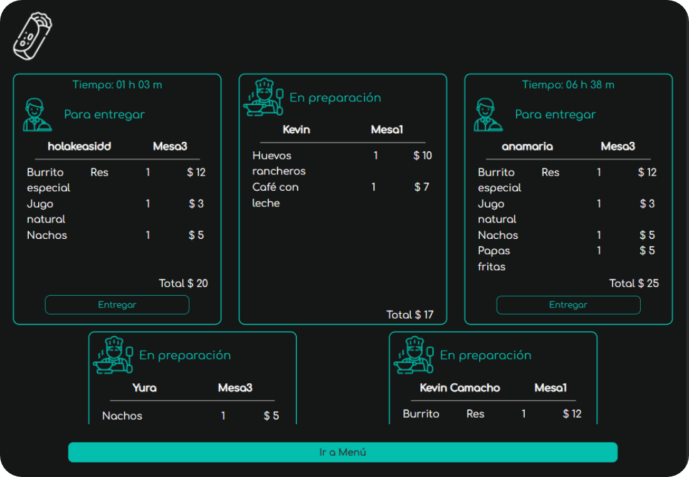
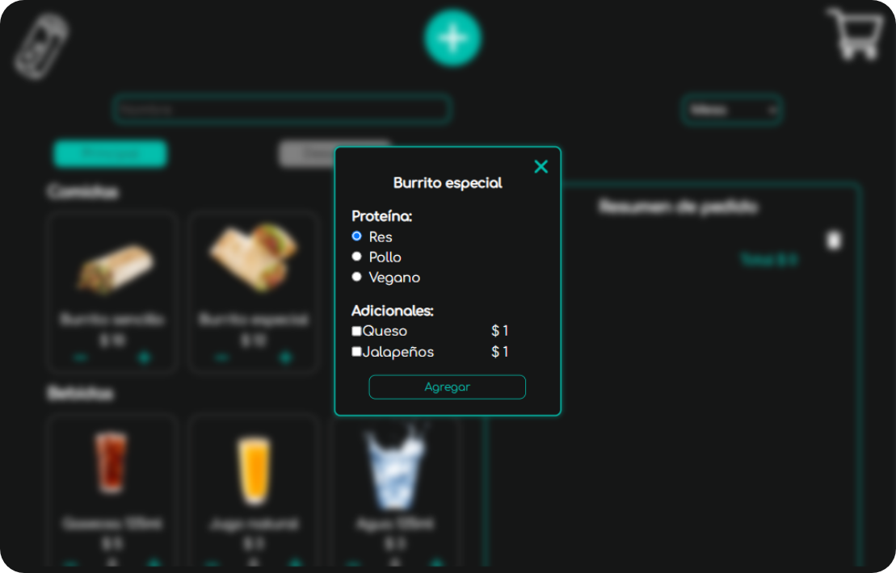
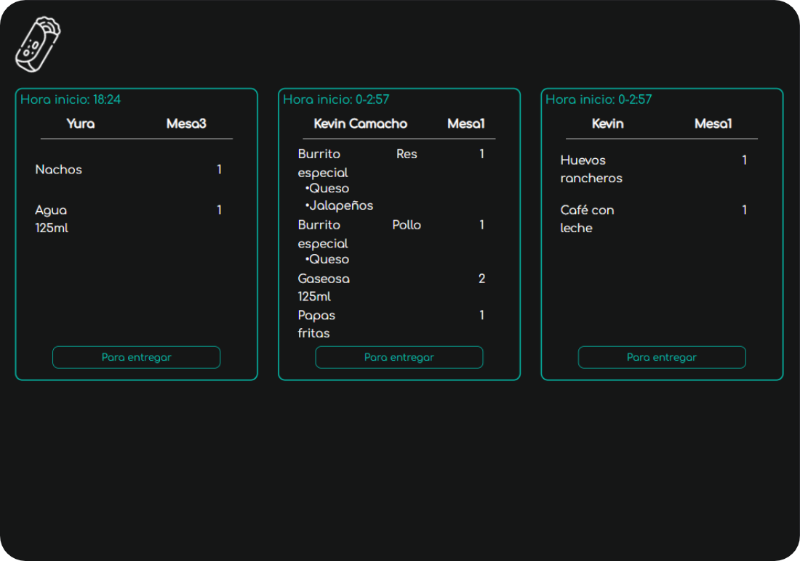

# Burger Queen

### *Realizado por Diana Buitrago, Xiomara Cárdenas y Yurany Toloza*

## Índice

* [1. Descripción del Proyecto](#1-descripción-el-Proyecto)
* [2. Historias de Usuario](#2-historias-de-usuario)
* [3. Prototipo](#3-prototipo)
* [4. Resultado Final](#4-resultado-final)

***

## 1. Descripción del Proyecto

Nuestra aplicación busca ofrecer una herramienta para tablet de fácil manejo que permite el proceso de toma de pedidos, enviarlos a la cocina para que se preparen ordenada y eficientemente en un restaurante mexicano.

La app está desarrollada con React, logrando que la interfaz se actualice con cada interacción del usuario. Dicha interfaz está maquetada para tablet de forma horizontal, sin embargo, manejamos un estilo responsive.

* ### Usuarios

    Nuestros usuarios son los meseros y el chef del restaurante la Catrina, por está razón la aplicación cuenta con dos perfiles, una vista para el mesero donde encuentra un menú para desayuno y otro menú para el resto del día, este puede tomar el respectivo pedido de sus clientes y posteriormente enviarlos a cocina. La otra vista corresponde al chef, en la que recibe los pedidos de forma ordenada para su preparación.
    
## 2. Historias de Usuario

* **HU 1:** Yo como meser@ quiero tomar el pedido de un cliente para evitar errores y poder enviar la orden correctamente a cocina, y así la puedan ir preparando en orden.
* **HU 2:** Yo como meser@ quiero ver tanto los precios individuales de cada producto, como el total según se vayan agregando para saber cuánto cobrar.
* **HU 3:** Yo como jefe de cocina quiero ver los pedidos de los clientes en orden para saber que se debe cocinar, y marcar cuales están listos para que el meser@ pase a recogerlos y pueda servirlo al cliente.
* **HU 4:** Yo como meser@ quiero ver los pedidos que están preparados y listos para entregarlos rápidamente a los clientes.

## 3. Prototipo

## 4. Resultado Final

